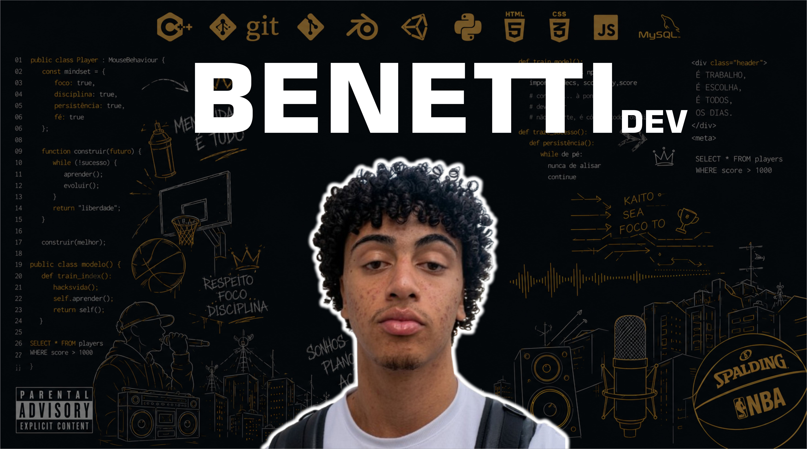

[🇺🇸 English/Inglês](README.md)

  

Eu sou Pedro Benetti

### 💻 Estudante de Desenvolvimento de Software Multiplataforma
### Desenvolvedor de Software | Unity Engine | Amante de Realidade Aumentada | Entusiasta em Design e Design de Sistemas

## Sobre mim

- 🎓 Estudante de Desenvolvimento de Software Multiplataforma
- 🧠 Apaixonado por Arquitetura de Software e Design de Sistemas
- 📱 Desenvolvedor de aplicativos móveis e web
- 🕶️ Explorando tecnologias de RA/RV com Unity e ARCore
- 🎨 Focado em UI/UX e interfaces criativas
- ⚙️ Interessado em sistemas escaláveis ​​e código limpo
- 📚 Sempre aprendendo novas tecnologias e aprimorando práticas de desenvolvimento
---

# Stacks Tecnológicas

### Linguagens

### Front-End

### Ferramentas e Tecnologias

# Áreas de interesse

- Arquitetura de Software
- Desenvolvimento Full-Stack
- Aplicativos Móveis
- Design 3D
- Realidade Aumentada
- Computação em Nuvem
- Plataformas de Streaming
- Modelagem de Banco de Dados
- Design de UI/UX
- IoT e Sistemas Inteligentes

# Projetos em Destaque

## Aplicações de RA com Unity

Experiências interativas de realidade aumentada utilizando Unity e ARCore.

## Sistema Inteligente de Monitoramento de Água

Projeto de IoT que utiliza sensores para analisar a turbidez e o volume da água.

## Experiências Web Criativas

Sites responsivos com interfaces imersivas e identidade visual marcante.

# Aprendendo atualmente

- Arquitetura de microsserviços
- Infraestrutura em nuvem
- Otimização avançada de bancos de dados
- Sistemas de backend escaláveis
- Padrões de projeto de front-end modernos

# 📊 Estatistícas do GitHub

 

# Conecte-se comigo

### "Acredite e seja você mesmo."

