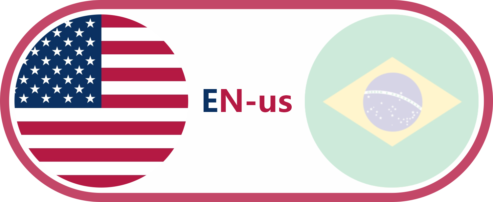

  

I am Pedro Benetti

### 💻 Multiplatform Software Development Student
### Software Developer | Unity Developer | AR Lover | System Design Enthusiast

## About Me

- 🎓 Multiplatform Software Development student
- 🧠 Passionate about Software Architecture & System Design
- 📱 Mobile and Web Application Developer
- 🕶️ Exploring AR/VR technologies with Unity & ARCore
- 🎨 Focused on UI/UX and creative interfaces
- ⚙️ Interested in scalable systems and clean code
- 📚 Always learning new technologies and improving development practices

# Tech Stack

### Languages

  

### Frameworks

  

### Tools & Technologies

  

# Areas of Interest

- Software Architecture
- Full-Stack Development
- Mobile Applications
- 3D Design
- Augmented Reality
- Cloud Computing
- Streaming Platforms
- Database Modeling
- UI/UX Design
- IoT & Smart Systems

# Featured Projects

## AR Applications with Unity

Interactive augmented reality experiences using Unity and ARCore.

## Smart Water Monitoring System

IoT project using sensors to analyze water turbidity and water volume.

## Creative Web Experiences

Responsive websites with immersive interfaces and strong visual identity.

# Currently Learning

- Microservices Architecture
- Cloud Infrastructure
- Advanced Database Optimization
- Scalable Backend Systems
- Modern Front-End Design Patterns

# 📊 GitHub Analytics

 

# Conect with me

### "Belive and be yourself."

